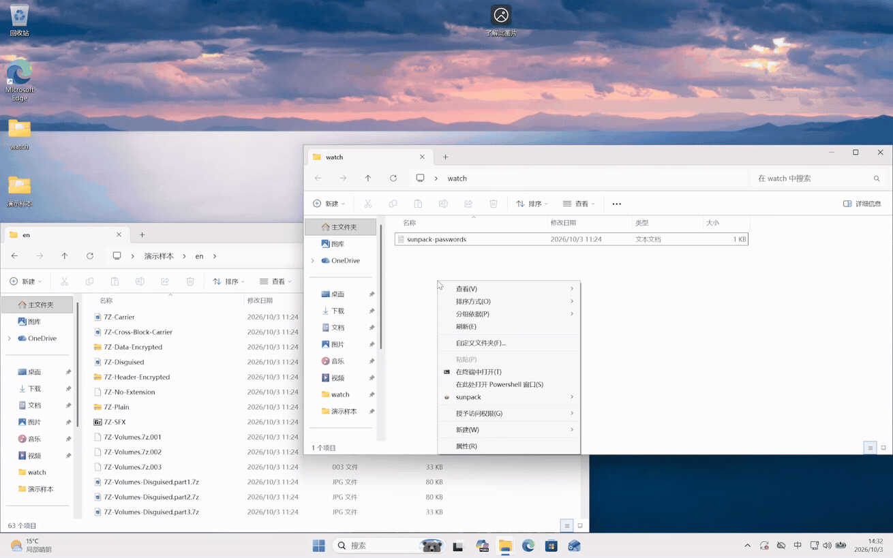

<p align="center">
  
</p>
<h1 align="center">SunPack</h1>
<p align="center"><b>A fully automated archive processing tool for Windows that handles compressed files in the background—no manual extraction required.</b><br></p>

<p align="center"><a href="README.md">简体中文</a> · <b>English</b> · <a href="https://github.com/Qinjingxue/Sunpack/releases/latest">Downloads</a></p>

<p align="center">
  <a href="https://github.com/Qinjingxue/Sunpack/releases/latest"></a>
  
  <a href="https://github.com/Qinjingxue/Sunpack/blob/main/LICENSE"></a>
</p>

<p align="center">
  
</p>

---

## Contents

- [Installation](#installation)
- [Usage guide](#usage-guide)
  - [Command overview](#command-overview)
  - [Password management](#password-management)
- [Core capabilities](#core-capabilities)
  - [Recursive processing](#recursive-processing)
  - [Post-processing](#post-processing)
  - [Watch mode monitoring system](#watch-mode-monitoring-system)
  - [Robustness and WAL crash recovery](#robustness-and-wal-crash-recovery)
  - [High concurrency and speed optimization](#high-concurrency-and-speed-optimization)
  - [Low background resource usage](#low-background-resource-usage)
- [Configuration](#configuration)
- [Development and testing](#development-and-testing)
  - [Development](#development)
  - [Architecture at a glance](#architecture-at-a-glance)
  - [Testing](#testing)
  - [Reproducible worker vs. 7-Zip benchmark](#reproducible-worker-vs-7-zip-benchmark)
- [Known Issue](#Known-Issue)
- [Contributing](#contributing)
- [Acknowledgements](#acknowledgements)
- [License](#license)

## Installation

### System requirements

SunPack supports only Windows 10 version 1607 or later and Windows 11. Watch mode only supports NTFS.

Download the latest `sunpack-windows-<arch>-<version>-setup.exe` from [GitHub Releases](https://github.com/Qinjingxue/Sunpack/releases/latest).

1. Pick the installer that matches your system architecture: `x64` for Intel/AMD 64-bit Windows, `arm64` for Windows on ARM.
2. Run the installer and accept the UAC elevation prompt. It installs to `C:\Program Files\SunPack` by default; installing the Watch Broker service requires administrator privileges.
3. Choose the optional items in the setup wizard as needed:
   - Add the installation directory to the machine `PATH`. Reopen PowerShell after the installation completes.
   - Register the Explorer context menu for folders and folder backgrounds.
   - Start SunPack Watch with Windows (disabled by default).

You can also run this command in PowerShell to download and install the latest version for your system architecture:

```powershell
$r = Invoke-RestMethod 'https://api.github.com/repos/Qinjingxue/Sunpack/releases/latest'; $arch = if ([Runtime.InteropServices.RuntimeInformation]::OSArchitecture -eq 'Arm64') { 'arm64' } else { 'x64' }; $a = $r.assets | Where-Object name -eq "sunpack-windows-$arch-$($r.tag_name)-setup.exe"; if (-not $a) { throw "Installer not found for $arch" }; $p = Join-Path $env:TEMP $a.name; Invoke-WebRequest $a.browser_download_url -OutFile $p; Start-Process $p -ArgumentList '/VERYSILENT','/SUPPRESSMSGBOXES','/NORESTART' -Wait
```

---

## Usage guide

### Command overview

| Command     | Short form | Description                                                          |
| ----------- | ---------- | -------------------------------------------------------------------- |
| `extract`   | `x`        | Extract files.                                                       |
| `watch`     | `w`        | Monitor directories and extract archives automatically once found.   |
| `scan`      | `s`        | Scan a directory for archives; useful for identifying archives.      |
| `inspect`   | `i`        | Print detailed detection data; a debugging command with JSON output. |
| `passwords` | `pw`       | Show the password list that will be attempted in this run.           |
| `config`    | `cfg`      | Show or validate the effective configuration.                        |
| `doctor`    | `d`        | Non-destructive check of installation and runtime health.            |
| `version`   | `ver`      | Print the installed SunPack version.                                 |

> See [CLI parameter reference](docs/cli_parameters.md) for detailed options.

### Password management

For maximum convenience, SunPack gathers passwords from several sources at run time, tries all candidate passwords at high speed — with thousands of candidates it is nearly imperceptible — and automatically finds and uses the correct one. The password sources are:

- Built-in password file: used on every extraction. It can be opened and edited from the tray context menu in watch mode, and lives at `%ProgramData%\SunPack\builtin_passwords.txt` in the installed version. Watch mode automatically collects clipboard history into this file, with a default limit of 30 entries.
- User input: the context menu, and the interactive password prompt launched from the CLI.
- Clipboard: the clipboard text is read as a password before extraction.
- Per-directory password file: SunPack automatically looks for `sunpack-passwords.txt` in the directory and reads each line as one password; watch mode creates it automatically by default. Set `watch.directory_password_file_auto_create` to `false` to disable automatic creation.

---

## Core capabilities

### Recognition Capability

- Identifies potential archive files by analyzing their binary data, including disguised archives embedded within carrier files and multi-volume archives.Currently supports ZIP, ZIPX, RAR, 7z, Zstandard (Zstd), Gzip, TAR, TBZ2, XZ, LZ4, ENCV4. ZIPX does not support WinZip-specific JPEG, MP3, or WavPack compression methods. LZ4 does not support legacy format or dictionaries.

### Recursive processing

- Recursively searches for nested archives by default: after a successful extraction it checks whether the resulting folder contains archives that clearly should be extracted further, and processes them recursively. The algorithm is tuned so that, in most cases, it does not wrongly extract files that should not be extracted further.

### Post-processing

- Automatically flattens meaningless nested single-child directories after a successful extraction, keeping only the top-level folder, and moves the original archive to the Recycle Bin or deletes it (controlled by the `"archive_cleanup_mode": "r"` setting; the Recycle Bin is the default). If processing fails, it automatically cleans up the failed output and reports an error.
- If files downloaded to a monitored folder need to remain available for BitTorrent seeding, please manually change "archive_cleanup_mode": "r" to "archive_cleanup_mode": "k". Otherwise, the source files may be deleted too quickly due to a race condition.

### Watch mode monitoring system

- The watch system is built on a carefully designed identification algorithm that monitors and processes archives. It quickly detects and identifies newly added archives in the relevant directories and ignores non-archive files.
- It can recognize situations with missing volumes or passwords, and automatically retries after the password sources or the volumes change. It uses Windows notifications to show progress while processing.
- Each monitored directory can be configured with its own output root. See [CLI parameter reference](docs/cli_parameters.md) for the exact commands and the persistence format.

### Robustness and WAL crash recovery

- Automatically pauses extraction tasks when disk space runs out, and resumes them once enough disk space is available again — no manual retry needed.
- Has a file verification system that allows partially damaged files to yield whatever usable files they can, instead of failing outright. When everything fails, it automatically cleans up the damaged files, leaving no leftovers that need manual cleanup.
- Adopts a database-like WAL design: an unexpected power loss or process crash during extraction leaves no half-finished or corrupted state; the program handles it correctly and completes the task after recovery.
- The test suite covers a wide range of complex archive formats, concurrency scenarios, and crash recovery cases to continuously verify processing correctness.

### High concurrency and speed optimization

- Processes large numbers of archives concurrently, and has a concurrency algorithm that distributes work sensibly. In multi-file scenarios there is no need to extract files one by one — just drop them into a directory and they are all extracted quickly and automatically.
- Handles the high-performance computation and I/O paths in Rust and C++ native code, using overlapped I/O to overlap the read, compute, and output stages of 7z extraction. Resource utilization is good.

* For the 7-Zip backend decoders, zlib-ng was used to accelerate Deflate decompression, while parallel decoding was implemented to improve RAR and BZip2 decompression performance.

- Has a rich set of benchmark cases for various scenarios, and is optimized for those benchmarks close to the maintainability limit.

### Low background resource usage

- Manages cache lifetimes well and automatically releases useless caches after processing files.
- Uses purely event notifications while the system is idle; an idle background process consumes no CPU on polling.

---

## Configuration

The main configuration file is `sunpack_config.json`; `sunpack_advanced_config.json` supplies additional defaults. Watch automatically reloads configuration changes.

The main configuration automatically overrides the advanced configuration, and fields can be freely moved between the two.

Configuration validation command:

```powershell
python sunpack.py config validate
```

See the [configuration guide](docs/configuration.md) for common settings and examples.

---

## Development and testing

### Development

Prepare the development environment:

```powershell
.\scripts\setup_windows_dev.ps1
```

Build the project:

```powershell
.\scripts\build_windows.ps1
```

See [the documentation](docs/development_setup.md) for development environment and build instructions.
See [the documentation](docs/development_boundaries.md) for development boundaries.
Developers using AI must ensure that the AI reads the repository's AGENTS.md before making any changes and follows the development guidelines specified therein.

### Architecture at a glance

```text
CLI / Watch / Explorer (runtime)
  -> pipeline coordinator
     -> filesystem routing
        +-- Relations (RAR / 7z / ZIP, including volumes)
        +-- Detection (TAR and compression streams)
        +-- Embedded discovery (unresolved files)
     -> recursive authorization -> password handling -> extraction
     -> verification -> post-processing
```

Rust provides low-level scanning and archive analysis; the C++ worker extracts with the integrated 7-Zip source code.

### Testing

Install the test dependencies and run the default tests:

```powershell
uv sync --locked --extra test
uv run --locked pytest
```

Acceptance tests:

```powershell
.\run_acceptance_tests.ps1
```

### Reproducible worker vs. 7-Zip benchmark

Detailed machine identity, archive construction, compression methods, and
reproduction instructions are in [the benchmark document](docs/benchmark_worker_vs_7z_300m.md).
The latest four-thread IOCP experiment, including output flush timings, is documented in
[the Gzip/ZIP concurrency report (Chinese)](docs/zh-CN/benchmark_worker_iocp_300m.md).
The follow-up [full-format regression](docs/zh-CN/benchmark_worker_iocp_fullformats_300m.md)
and [1/4/8 IOCP consumer comparison](docs/zh-CN/benchmark_worker_iocp_threads_300m.md)
include paired timings and explicit output flushes.
The [current 8-thread IOCP worker vs. concurrent 7z.exe retest](docs/zh-CN/benchmark_worker_iocp_vs_cli_300m.md)
covers all 18 format/variant cases, a mixed queue, and targeted input/CPU diagnostics.
The [subsequent parallelism optimization report](docs/zh-CN/benchmark_worker_parallel_300m.md)
records retained CRC32/Open changes, administrator CPU sampling, and remaining gaps.
These results use SunPack **v0.7.9** from repository commit `b9fdfa6d`, with the
worker built from the same commit. The retest ran on 2026-10-03: 18 cases, five
measured runs per case, and no warmups. Times and sampled process-tree peak RSS
are per-case medians; RSS is in MiB. Worker time and memory are grouped together,
followed by the same metrics for `7z.exe`. The raw full-matrix report is
`benchmarks/results/worker-vs-7z-300m-v0.7.9-b9fdfa6-rss-20261003.json`.

| Format / variant | Worker time (ms) | `7z.exe` time (ms) | Time ratio | Worker peak RSS (MiB) | `7z.exe` peak RSS (MiB) | RSS ratio |
| ---------------- | :--------------- | :----------------- | :--------- | :-------------------- | :---------------------- | :-------- |
| 7z split         | 141.886          | 203.605            | 0.697      | 476.199               | 458.379                 | 1.039     |
| 7z non-solid     | 188.029          | 250.020            | 0.752      | 324.137               | 308.047                 | 1.052     |
| 7z solid         | 142.802          | 204.641            | 0.698      | 475.652               | 458.309                 | 1.038     |
| BZip2            | 1,670.859        | 2,914.191          | 0.573      | 43.289                | 12.625                  | 3.429     |
| Gzip             | 81.731           | 209.743            | 0.390      | 25.188                | 8.215                   | 3.066     |
| RAR5 split       | 172.453          | 768.066            | 0.225      | 54.242                | 40.516                  | 1.339     |
| RAR4 non-solid   | 80.926           | 185.464            | 0.436      | 27.488                | 11.598                  | 2.370     |
| RAR4 solid       | 539.789          | 652.330            | 0.827      | 28.211                | 12.348                  | 2.285     |
| RAR5 non-solid   | 95.293           | 186.992            | 0.510      | 56.250                | 39.605                  | 1.420     |
| RAR5 solid       | 168.938          | 745.597            | 0.227      | 57.289                | 40.477                  | 1.415     |
| TAR              | 76.350           | 120.331            | 0.634      | 24.031                | 7.297                   | 3.293     |
| TBZ2             | 1,663.736        | 2,890.008          | 0.576      | 44.141                | 12.625                  | 3.496     |
| TGZ              | 84.974           | 213.233            | 0.399      | 25.215                | 8.219                   | 3.068     |
| TXZ              | 156.893          | 181.328            | 0.865      | 474.617               | 458.523                 | 1.035     |
| TZST             | 100.259          | 188.752            | 0.531      | 23.012                | 9.789                   | 2.351     |
| XZ               | 169.011          | 183.459            | 0.921      | 474.621               | 458.520                 | 1.035     |
| ZIP              | 76.254           | 198.892            | 0.383      | 25.289                | 7.984                   | 3.167     |
| ZST              | 104.599          | 181.936            | 0.575      | 23.039                | 9.789                   | 2.354     |

---

## Known Issue

- When SunPack monitors a download directory, some downloaders may perform final file verification relatively slowly. SunPack may finish processing the archive and clean up the source files before the downloader completes its verification, causing the downloader to consider the source files corrupted and retry the download or report an error.

## Contributing

Contributions are welcome. Use [GitHub Issues](https://github.com/Qinjingxue/Sunpack/issues) to report bugs or suggest improvements, and submit a [Pull Request](https://github.com/Qinjingxue/Sunpack/pulls) to help improve the project.

## Acknowledgements

Thank you to everyone who contributes code, reports issues, or shares suggestions for SunPack. The project also benefits from many open-source projects. Special thanks to the maintainers and contributors of [7-Zip](https://www.7-zip.org/), [zlib-ng](https://github.com/zlib-ng/zlib-ng), [LZ4](https://github.com/lz4/lz4), and [RustCrypto](https://github.com/RustCrypto). See [THIRD_PARTY_NOTICES.md](THIRD_PARTY_NOTICES.md) for details about third-party components and their licenses.

## License

The root [LICENSE](LICENSE) (MIT) applies to SunPack-original code. It does not mean that third-party code or binaries are also licensed under MIT.

The repository includes several third-party components, including 7-Zip 26.03 at `native/sevenzip_bridge/7z2603-src/`, zlib-ng 2.3.3 at `native/sevenzip_bridge/zlib-ng-2.3.3/`, LZ4 1.10.0 at `native/third_party/lz4/`, and cryptographic algorithm implementations adapted from RustCrypto. These components remain subject to their respective original licenses. For component scope, copyright and license information, and the license materials required for releases, see [THIRD_PARTY_NOTICES.md](THIRD_PARTY_NOTICES.md), [licenses/](licenses/), and [docs/licensing.md](docs/licensing.md).

The 7-Zip source license is copied at [licenses/7zip-source-license.txt](licenses/7zip-source-license.txt), and the full GNU LGPL 2.1 text is available at [licenses/LGPL-2.1.txt](licenses/LGPL-2.1.txt). License copies for other components are in [licenses/](licenses/).

The [input prefetch optimization experiments](docs/zh-CN/benchmark_worker_prefetch_300m.md)
were rejected because gains did not hold across single-job and concurrent workloads.
