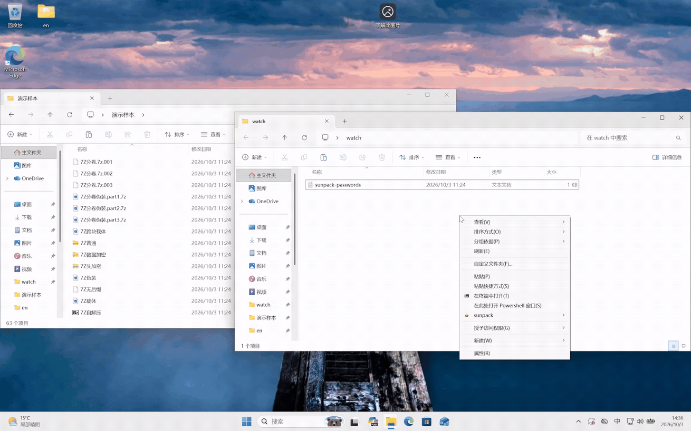

<p align="center">
  
</p>
<h1 align="center">SunPack</h1>
<p align="center"><b>面向 Windows 的全自动化压缩包处理工具，后台自动处理压缩包，无需手动解压</b><br></p>

<p align="center"><b>简体中文</b> · <a href="README.en.md">English</a> · <a href="https://github.com/Qinjingxue/Sunpack/releases/latest">下载</a></p>

<p align="center">
  <a href="https://github.com/Qinjingxue/Sunpack/releases/latest"></a>
  
  <a href="https://github.com/Qinjingxue/Sunpack/blob/main/LICENSE"></a>
</p>

<p align="center">
  
</p>

---

## 内容导航

- [安装说明](#安装说明)
- [使用指南](#使用指南)
  - [命令速览](#命令速览)
  - [密码管理](#密码管理)
- [核心能力](#核心能力)
  - [递归处理](#递归处理)
  - [后处理](#后处理)
  - [Watch模式监控系统](#watch模式监控系统)
  - [稳健性和wal崩溃恢复](#稳健性和wal崩溃恢复)
  - [高并发和速度优化](#高并发和速度优化)
  - [后台低资源占用](#后台低资源占用)
- [配置](#配置)
- [开发与测试](#开发与测试)
  - [开发相关](#开发相关)
  - [架构速览](#架构速览)
  - [测试](#测试)
  - [可复现的 worker 与 7-Zip 对比测试](#可复现的-worker-与-7-zip-对比测试)
- [已知问题](#已知问题)
- [参与贡献](#参与贡献)
- [致谢](#致谢)
- [许可证](#许可证)

## 安装说明

### 系统要求

SunPack 仅支持 Windows 10 版本 1607 及更高版本和 Windows 11。其中Watch模式仅支持NTFS文件系统。

从 [GitHub Releases](https://github.com/Qinjingxue/Sunpack/releases/latest) 下载最新的 `sunpack-windows-<arch>-<version>-setup.exe`

1. 根据系统架构选择安装包：Intel/AMD 64 位 Windows 选择 `x64`，Windows on ARM 选择 `arm64`。
2. 运行安装器并接受 UAC 提权。默认安装到 `C:\Program Files\SunPack`；安装 Watch Broker 服务需要管理员权限。
3. 按需选择安装向导中的附加项：
   - 将安装目录加入本机 `PATH`。完成安装后请重新打开 PowerShell。
   - 注册资源管理器中的文件夹、文件夹背景右键菜单。
   - 随 Windows 启动 SunPack Watch（默认不启用）。

也可以在 PowerShell 中运行以下命令，自动下载并安装适用于当前系统架构的最新版：

```powershell
$r = Invoke-RestMethod 'https://api.github.com/repos/Qinjingxue/Sunpack/releases/latest'; $arch = if ([Runtime.InteropServices.RuntimeInformation]::OSArchitecture -eq 'Arm64') { 'arm64' } else { 'x64' }; $a = $r.assets | Where-Object name -eq "sunpack-windows-$arch-$($r.tag_name)-setup.exe"; if (-not $a) { throw "Installer not found for $arch" }; $p = Join-Path $env:TEMP $a.name; Invoke-WebRequest $a.browser_download_url -OutFile $p; Start-Process $p -ArgumentList '/VERYSILENT','/SUPPRESSMSGBOXES','/NORESTART' -Wait
```

---

## 使用指南

### 命令速览

| 命令        | 简写  | 说明                                         |
| ----------- | ----- | -------------------------------------------- |
| `extract`   | `x`   | 解压文件                                     |
| `watch`     | `w`   | 监控目录，发现压缩文件后自动解压             |
| `scan`      | `s`   | 扫描发现目录下压缩包，可用于识别归档         |
| `inspect`   | `i`   | 输出详细检测数据，调试命令，支持json诊断输出 |
| `passwords` | `pw`  | 查看本次会参与尝试的密码列表。               |
| `config`    | `cfg` | 查看或校验当前有效配置                       |
| `doctor`    | `d`   | 非破坏性检查安装状态和运行环境               |
| `version`   | `ver` | 输出当前安装的 SunPack 版本号                |

> 详细参数见 [CLI 参数说明](docs/zh-CN/cli_parameters.md)。

### 密码管理

Sunpack为达到最大方便性，在使用时会尝试从各处获取密码，高速尝试所有候选密码，在上千候选密码下几乎无感速度，自动找到正确密码并使用，使用的密码来源有：

- 内置密码文件：每次解压均使用，可在watch模式下使用托盘右键菜单打开修改，安装版位于%ProgramData%\SunPack\builtin_passwords.txt。其中watch模式会自动收集剪贴板历史记录写入该文件，上限配置默认30条
- 用户输入：右键菜单，CLI调出的交互输入密码模式的输入
- 剪贴板：解压前自动读取剪贴板文本作为密码
- 目录下的密码记录文件：自动寻找目录下的sunpack-passwords.txt，读取每行作为一个密码；watch模式默认会自动创建，可将 `watch.directory_password_file_auto_create` 设为 `false` 关闭自动创建

---

## 核心能力

### 识别能力

- 通过文件二进制数据识别潜在的压缩文件，支持伪装性嵌入载体文件，分卷文件等，目前支持zip,zipx,rar,7z,zstd,gz,tar,tbz2,xz,lz4,ENCV4(zipx不支持 WinZip 专用 JPEG、MP3、WavPack 算法，lz4不支持legacy和dictionary)

### 递归处理

- 默认递归寻找嵌套压缩包，即在解压成功后的文件夹下寻找是否有明显的需要进一步解压的压缩包并进行递归处理，该算法经过优化，大部分情况下不会误解压不应进一步解压的文件

### 后处理

- 自动在解压成功后压平无意义嵌套单子目录，只保留顶层文件夹，并将原压缩文件移入回收站或者直接删除（配置："archive_cleanup_mode": "r"调整，默认移入回收站），如果处理出错会自动清理错误输出并报错
- 如果监控的文件夹内，下载的文件是需要进行BT做种的，请手动调整"archive_cleanup_mode": "r"至"k"，不然源文件可能存在竞态被迅速删除

### Watch模式监控系统

- watch监控系统基于精心设计的识别算法，监控并处理压缩文件，能够迅速监控并识别对应目录新增的压缩文件，不处理非压缩文件
- 能够识别缺失分卷或密码的场景，并在密码来源或者分卷变化后自动重试。进行处理时使用windows通知来显示进度
- 每个监控目录可以配置独立的输出根目录，具体命令和持久化格式见 [CLI 参数说明](docs/zh-CN/cli_parameters.md)。

### 稳健性和WAL崩溃恢复

- 在磁盘空间不足时自动暂停解压任务，并能够自动在磁盘空间充足后继续解压，无需手动重试
- 拥有文件验证系统，允许部分损坏文件解压出部分可用文件，而不是一次性失败，完全失败时也能自动清理损坏文件，不会残留需手动清理的遗留文件
- 采用类似数据库的WAL思想，解压处理过程中意外断电或进程崩溃不会留下半成品或损坏状态，程序能正确处理并在恢复后完成任务
- 测试体系覆盖多种复杂归档、并发与崩溃恢复场景，用于持续验证处理正确性。

### 高并发和速度优化

- 一次性可并发处理大量归档文件，且有一套并发算法来合理分配并发，在多文件解压场景下无需手动单独解压，将文件放入一个目录内即可自动迅速完成解压
- 高性能计算和IO部分使用Rust和C++原生代码处理，且使用overlapped IO，重叠7z解压时的读取，计算和输出部分，拥有较好的资源利用能力
- 7z后端解码器上，使用zlib-ng优化了7z的Deflate解码速度，使用并发计算优化了rar和bz2的解码速度
- 针对各种场景有丰富benchmark用例，针对benchmark优化接近可维护性上限

### 后台低资源占用

- 缓存生命周期管理完善，自动在处理文件后释放无用缓存
- 系统空闲时完全事件通知，后台空闲无轮询检测占用CPU

---

## 配置

主配置文件是 `sunpack_config.json`，`sunpack_advanced_config.json` 提供其余默认值。Watch 会自动重新加载配置变更。

主配置自动覆盖高级配置，可以自由把字段在二者之间进行迁移。

配置校验命令：

```powershell
python sunpack.py config validate
```

常用设置和示例见 [配置指南](docs/zh-CN/configuration.md)。

---

## 开发与测试

### 开发相关

准备开发环境：

```powershell
.\scripts\setup_windows_dev.ps1
```

构建项目：

```powershell
.\scripts\build_windows.ps1
```

开发环境和构建说明见 [文档](docs/zh-CN/development_setup.md)。
开发边界见文档 [文档](docs/zh-CN/development_boundaries.md)
使用AI开发者务必使AI阅读仓库内的AGENTS.md进行开发，并遵守开发规范

### 架构速览

```text
CLI / Watch / 资源管理器（runtime）
  -> 流程协调器（pipeline）
     -> 文件系统扫描与分流
        +-- Relations：RAR / 7z / ZIP，含分卷
        +-- Detection：TAR 和压缩流
        +-- Embedded：处理未识别文件中的嵌入归档
     -> 递归授权 -> 密码处理 -> 解压
     -> 结果校验 -> 后处理
```

Rust 负责底层扫描和归档分析；C++ worker 集成 7-Zip 源码执行解压。

### 测试

安装测试依赖并运行默认测试：

```powershell
uv sync --locked --extra test
uv run --locked pytest
```

验收测试：

```powershell
.\run_acceptance_tests.ps1
```

### 可复现的 worker 与 7-Zip 对比测试

详细的机器信息、归档构造、压缩方法和复现说明见[独立 benchmark 文档](docs/zh-CN/benchmark_worker_vs_7z_300m.md)。
以下结果使用 **SunPack v0.7.9**，仓库与 worker 源码提交均为 `b9fdfa6d`。
测试日期为 2026-10-03，共 18 个 case，每个测量 5 次、不预热。耗时和进程树
采样峰值 RSS 均为每个 case 的中位数，RSS 单位为 MiB。表中先展示 worker 的
耗时和内存，再展示 `7z.exe` 的对应数据。全矩阵报告位于
`benchmarks/results/worker-vs-7z-300m-v0.7.9-b9fdfa6-rss-20261003.json`。

| 格式 / 变体    | Worker 耗时（ms） | `7z.exe` 耗时（ms） | 耗时比 | Worker 峰值 RSS（MiB） | `7z.exe` 峰值 RSS（MiB） | RSS 比 |
| -------------- | :---------------- | :------------------ | :----- | :--------------------- | :----------------------- | :----- |
| 7z split       | 141.886           | 203.605             | 0.697  | 476.199                | 458.379                  | 1.039  |
| 7z non-solid   | 188.029           | 250.020             | 0.752  | 324.137                | 308.047                  | 1.052  |
| 7z solid       | 142.802           | 204.641             | 0.698  | 475.652                | 458.309                  | 1.038  |
| BZip2          | 1,670.859         | 2,914.191           | 0.573  | 43.289                 | 12.625                   | 3.429  |
| Gzip           | 81.731            | 209.743             | 0.390  | 25.188                 | 8.215                    | 3.066  |
| RAR5 split     | 172.453           | 768.066             | 0.225  | 54.242                 | 40.516                   | 1.339  |
| RAR4 non-solid | 80.926            | 185.464             | 0.436  | 27.488                 | 11.598                   | 2.370  |
| RAR4 solid     | 539.789           | 652.330             | 0.827  | 28.211                 | 12.348                   | 2.285  |
| RAR5 non-solid | 95.293            | 186.992             | 0.510  | 56.250                 | 39.605                   | 1.420  |
| RAR5 solid     | 168.938           | 745.597             | 0.227  | 57.289                 | 40.477                   | 1.415  |
| TAR            | 76.350            | 120.331             | 0.634  | 24.031                 | 7.297                    | 3.293  |
| TBZ2           | 1,663.736         | 2,890.008           | 0.576  | 44.141                 | 12.625                   | 3.496  |
| TGZ            | 84.974            | 213.233             | 0.399  | 25.215                 | 8.219                    | 3.068  |
| TXZ            | 156.893           | 181.328             | 0.865  | 474.617                | 458.523                  | 1.035  |
| TZST           | 100.259           | 188.752             | 0.531  | 23.012                 | 9.789                    | 2.351  |
| XZ             | 169.011           | 183.459             | 0.921  | 474.621                | 458.520                  | 1.035  |
| ZIP            | 76.254            | 198.892             | 0.383  | 25.289                 | 7.984                    | 3.167  |
| ZST            | 104.599           | 181.936             | 0.575  | 23.039                 | 9.789                    | 2.354  |

---

## 已知问题

- sunpack如果监控下载目录，在最终压缩包处理后，部分下载器的校验行为执行较慢，而sunpack可能在下载器校验时已经完成了源文件的清理，导致下载器认为源文件损坏，从而重试下载或报错。

## 参与贡献

欢迎通过 [GitHub Issues](https://github.com/Qinjingxue/Sunpack/issues) 报告问题、提出建议，也欢迎提交 [Pull Request](https://github.com/Qinjingxue/Sunpack/pulls) 改进项目。

## 致谢

感谢所有为 SunPack 提交代码、报告问题和提供建议的贡献者与用户。SunPack 也受益于众多开源项目，特别感谢 [7-Zip](https://www.7-zip.org/)、[zlib-ng](https://github.com/zlib-ng/zlib-ng)、[LZ4](https://github.com/lz4/lz4) 和 [RustCrypto](https://github.com/RustCrypto) 项目及其维护者。相关第三方组件和许可证信息见 [THIRD_PARTY_NOTICES.md](THIRD_PARTY_NOTICES.md)。

## 许可证

仓库根目录的 [LICENSE](LICENSE)（MIT）适用于 SunPack 原创代码，不代表第三方代码或二进制也采用 MIT 许可证。

仓库包含多个第三方组件，包括位于 `native/sevenzip_bridge/7z2603-src/` 的 7-Zip 26.03、位于 `native/sevenzip_bridge/zlib-ng-2.3.3/` 的 zlib-ng 2.3.3、位于 `native/third_party/lz4/` 的 LZ4 1.10.0，以及改编自 RustCrypto 的加密算法实现。这些组件仍受各自原始许可证约束。各组件的范围、版权与许可证信息，以及发布时需要附带的许可材料，详见 [THIRD_PARTY_NOTICES.md](THIRD_PARTY_NOTICES.md)、[licenses/](licenses/) 和 [docs/licensing.md](docs/licensing.md)。

其中，7-Zip 源码许可证副本位于 [licenses/7zip-source-license.txt](licenses/7zip-source-license.txt)，GNU LGPL 2.1 完整文本位于 [licenses/LGPL-2.1.txt](licenses/LGPL-2.1.txt)；其他组件的许可证副本见 [licenses/](licenses/)。
